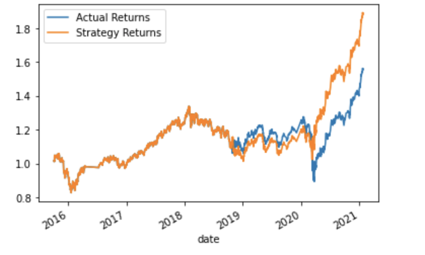
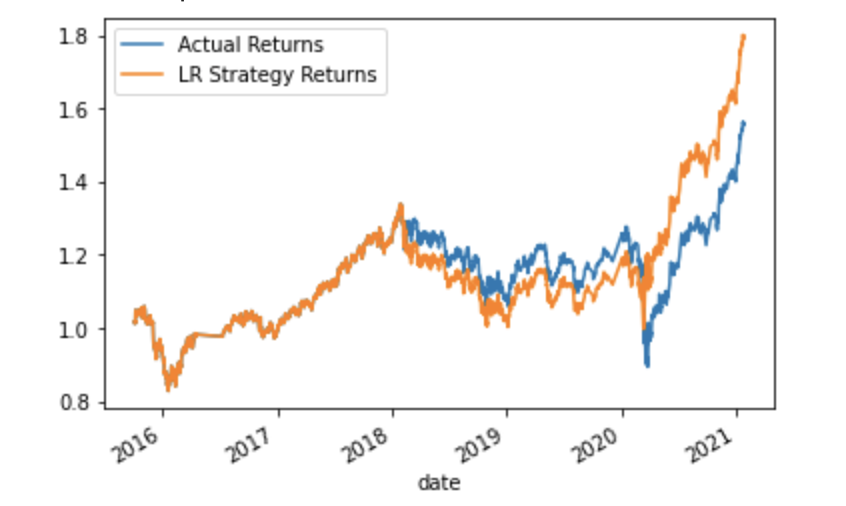
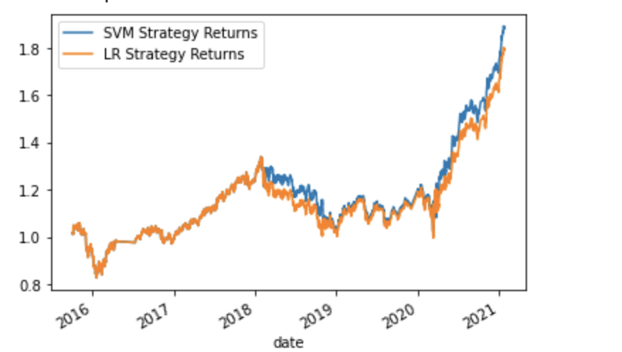

# Machine_Learning_Trading_Bot
CH14

In recent years, many firms are heavily profited by using computer algorithms that can buy and sell faster than human traders. The speed of these transactions creates competitive advantage early on. But, people still need to specifically program these systems, which limits their ability to adapt to new data. 

In this python program, I am planning to improve an existing algorithmic trading systems by enhancing the existing trading signals with machine learning algorithms that can adapt to new data.

### Step 1: Tune the Baseline Trading Algorithm

1. Tune, or adjust, the model’s 'DateOffset' from 3 to 6 months. The Logistic Regression strategy return increase and the precision of classification report also increased

2. Decreasing the SMA windows for the algorithm lower the returns for both strategies. Increase the SMA windows lowers the returns even more. So the best windows are the existing one, which is 8 for short window and 100 for long window.

3. Actual returns vs. Strategy returns

SVM Strategy Return VS Actual Returns

LR Strategy Return VS Actual Returns

LR Strategy Return VS SVM Strategy Returns

